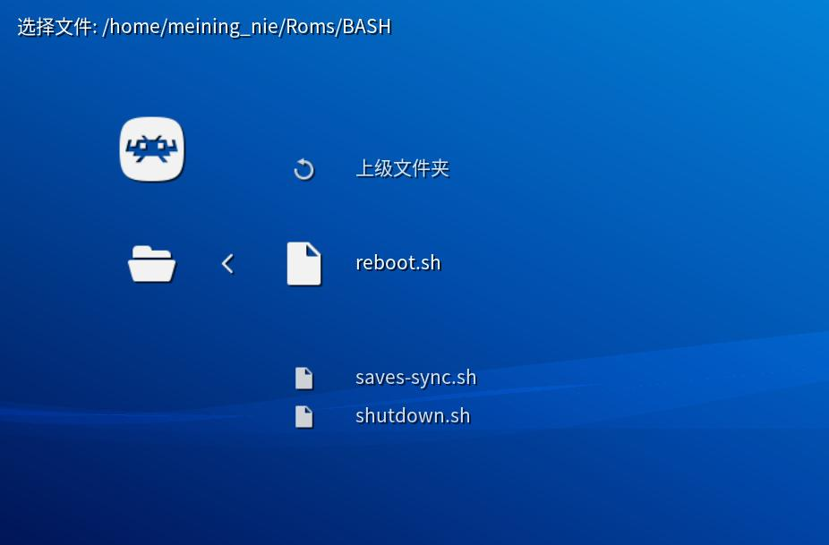

# libretro-bash-launcher

This core allows you to select and execute bash scripts directly from [RetroArch](http://www.libretro.com/), so that you can perform any non-gaming tasks using a controller without having to exit RetroArch.



Note: Bash scripts can harm your system. Be careful to ensure that the bash scripts you want to execute do not contain malicious code!


## Installation

1. Compile the core
    ``` bash
    git clone https://github.com/meiningnie/libretro-bash-launcher.git
    cd libretro-bash-launcher
    make
    ```

2. Copy the core file to the RetroArch cores directory
    ``` bash
    cp bash_launcher_libretro.so /usr/lib/libretro/
    cp bash_launcher_libretro.info /usr/share/libretro/info/
    ```


## Usage

Just select and execute any script from your hard drive, in exactly the same way as finding and launching game roms.

There're some scripts in the "scripts" directory, which I often use. But they may only work in my Environment (Ubuntu 24.04). If you want to use them, you may need to make some modifications to suit your own environment.

Note: The script file does **NOT** need to have executable permissions, but **MUST** end with a ".sh" extension.


## Contributors

- Meining NIE (meiningnie@gmail.com)


## Other Comments - For Flashing ASUS ROG Ally to Ubuntu System

My "ASUS ROG Ally" is a nice toy, but Windows sucks. It's always trying to get my attention and cause trouble, not to mention the inexplicable power consumption and endless updates.

So I've finally decided to install Ubuntu 24.04 with RetroArch on it. For an old boy like me, RetroArch is more than enough.

If you happen to want to do the same thing, here are some tips that could help make your life easier.

1. According to my test, Ubuntu 24.04 supports ROG Ally perfectly. You can just download the official image to install it. Although the network card was not recognized at first, but it became OK later on its own. So I think it may be a coincidence.

2. Before installation, you have to turn off secure boot in BIOS and turn off the startup sound (some say that it affects the sound card). You also have to turn off bitlocker in Windows and decrypt the whole disk, otherwise you won't see your disk during the installation. By the way, the decryption process could take a very long time. Windows is really troublesome.

3. After the installation, you should install RetroArch as well as many packages you want. Note that RetroArch might not recognize the controller correctly after it's first installed, but it will function well after you perform some updating. Let's skip this step.

4. Obtain "sudo" privileges without entering a password, so that many system-level scripts could successfully work with this bash-launcher. You can do it by adding this line `your_account_name ALL=(ALL:ALL) NOPASSWD: ALL"` **at the end of** the file `/etc/sudoers`.

5. Enable "auto login" feature for your account, by adding the following content in file `/etc/gdm3/custom.conf`.
    ```
    [daemon]
    AutomaticLoginEnable=true
    AutomaticLogin=your_account_name
    ```

6. Enforce the "auto login" feature, even if we log out manually or accidentally, because we don't have a keyboard. You can do it by adding `systemctl restart gdm3` in file `/etc/gdm3/PostSession/Default`. Here is what this file looks like in my environment.
    ```
    #!/bin/sh
    systemctl restart gdm3
    exit 0
    ```

7. Make RetroArch automatically startup after login. I use the "Startup Applications Preferences" to do it, which is a built-in tool. But I recommend that you do not specify `retroarch` as the auto-start program directly, but write a script to launch it in a loop, and then specify this script as the auto-start program. In this way, if RetroArch exits or crashes, it can automatically recover. This script can be simply written like this:
    ```
    #!/bin/bash
    while true
    do
        retroarch
        sleep 1
    done
    ```

8. After all these steps above, you can find that ROG Ally will only have the RetroArch interface after startup. So you can make the Desktop more clean if you want. For example, Deleting all icons on Desktop, changing wallpaper to pure black, completely hiding the side bar (i.e., the Dock) and the top bar via gnome-shell-extensions, and disabling the overview mode with [this one](https://extensions.gnome.org/extension/4099/no-overview/). Finally, the only interactive interface left is RetroArch.


9. Make it possible to adjust the screen brightness through controller buttons. This is the most tricky part, because ROG Ally doesn't have some physical buttons to adjust the screen brightness. This is serious. Remember, we deleted the top bar in the previous step. Even if you didn't do it, you definitely don't want to get out of RA and use the touch screen to operate the system menu. Fortunately, the "M1" key combination comes with some factory preset keyboard shortcuts. For example, holding down "M1" (the button on the back) and pressing "up" or pressing "down" will trigger "super + d" or trigger "super + tab" respectively. Theses two are used to show Desktop and to switch window. Since we have neither Desktop nor windows, it is ideal to map them to adjust screen brightness. You also need to install "dconf-editor", which allows you to set keyboard shortcut for brightness changing.


## Acknowledgements

This project is built upon the framework provided by [libretro-dolphin-launcher](https://github.com/RobLoach/libretro-dolphin-launcher.git), created by [Rob Loach](http://github.com/robloach). I have made modifications to the original source code to suit my needs.

I appreciate the foundational work provided by [Rob Loach](http://github.com/robloach) and hope that my modifications contribute positively to the community.
