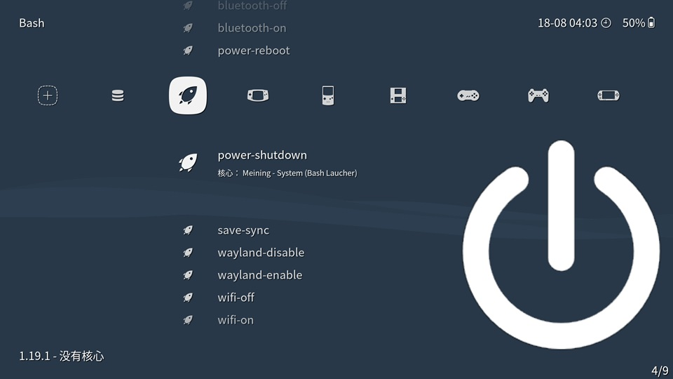

# libretro-bash-launcher

This core allows you to select and execute bash scripts directly from [RetroArch](http://www.libretro.com/), so that you can perform any non-gaming tasks using a controller without having to exit RetroArch.



Note: Bash scripts can harm your system. Be careful to ensure that the bash scripts you want to execute do not contain malicious code!


## Installation

1. Compile the core
    ``` bash
    git clone https://github.com/meiningnie/libretro-bash-launcher.git
    cd libretro-bash-launcher
    make
    ```

2. Copy the core file to the RetroArch cores directory
    ``` bash
    cp bash_launcher_libretro.so /usr/lib/libretro/
    cp bash_launcher_libretro.info /usr/share/libretro/info/
    ```


## Usage

Just select and execute any script from your hard drive, in exactly the same way as finding and launching game roms.

There're some scripts in the "scripts" directory, which I often use. But they may only work in my Environment (Ubuntu 24.04). If you want to use them, you may need to make some modifications to suit your own environment.

Note: The script file does **NOT** need to have executable permissions, but **MUST** end with a ".sh" extension.


## Contributors

- Meining NIE (meiningnie@gmail.com)


## Acknowledgements

This project is built upon the framework provided by [libretro-dolphin-launcher](https://github.com/RobLoach/libretro-dolphin-launcher.git), created by [Rob Loach](http://github.com/robloach). I have made modifications to the original source code to suit my needs.

I appreciate the foundational work provided by [Rob Loach](http://github.com/robloach) and hope that my modifications contribute positively to the community.
